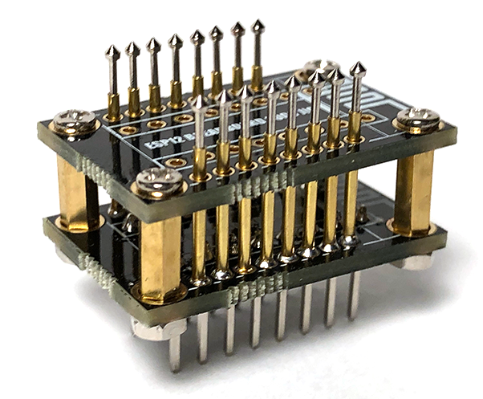

# ESP12 Breadboard Pogo Pin Jig Adapter
This is a simple PCB jig that can be used to interface a ESP12 to a breadboard using pogo pins. Top and bottom PCBs are the same and stacked together for stability.

Uses 1mm diameter pogo pins and M2 Standoffs.

You can download the gerber files directly and upload them to your PCB manufacturer of choice, or [you can order directly from PCBS.IO from this link](https://PCBs.io/share/8g7P3) as I've made the boards shared on that site.

